# Zotero 双语阅读（Bilingual Reader）

在 Zotero 10 里把英文论文按句对照翻译成中文阅读。原 PDF 不改动，不新增附件；译文缓存在 Zotero 数据目录下的单独文件里。

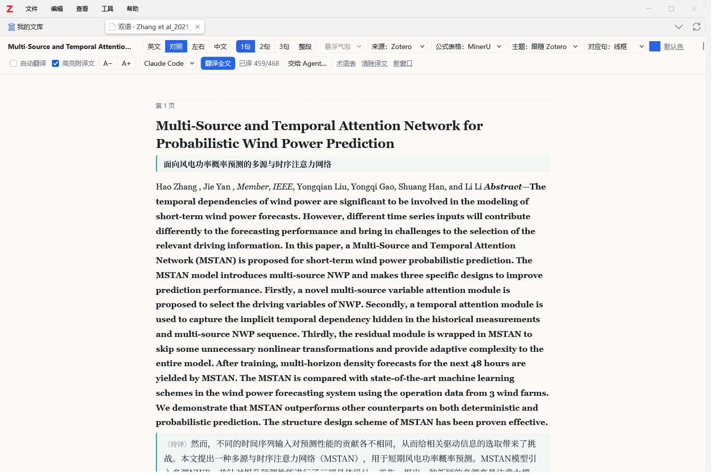

## 功能

### 四种显示方式

英文、对照（英文段落下接中文）、左右、中文，快捷键 `1` `2` `3` `4`，`+` `-` 调字号。

| 左右对照 | 纯中文 |
| --- | --- |
| 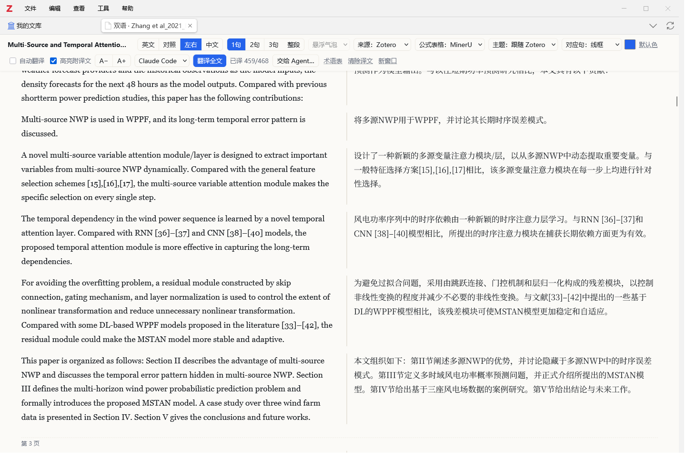 | 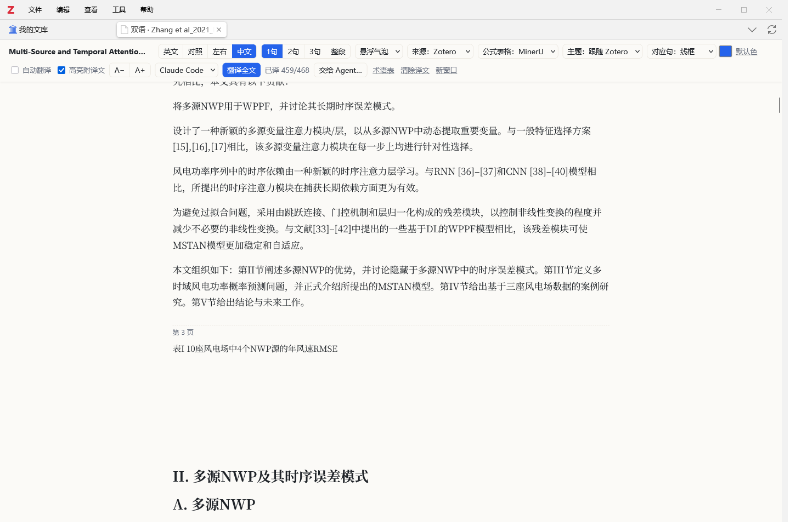 |

单语模式下看另一种语言：悬浮气泡、段下展开、点击切换、不提示，四种方式可选。

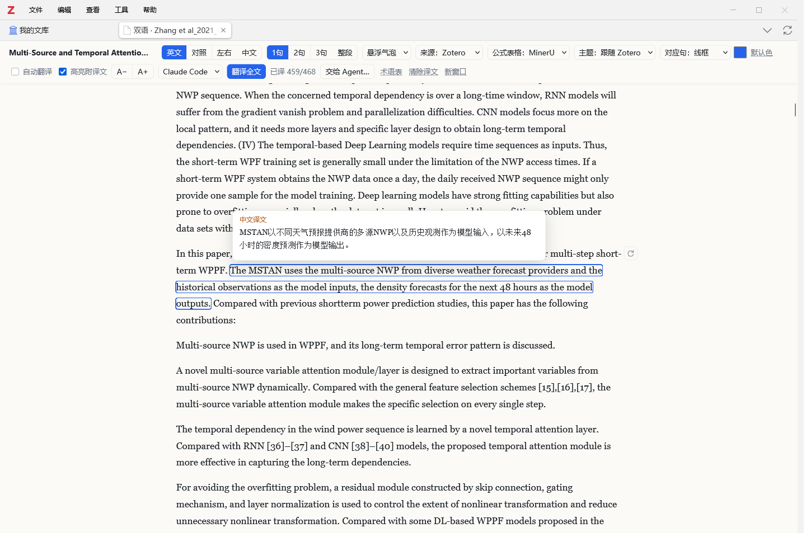

### 按句对应

悬停或选中句子时，两种语言的对应句同时标出。标记方式（线框、下划线、底色）和颜色在工具栏“对应句”里选，默认细线框，不和 Zotero 注释的底色混淆。对应粒度可选 1 句、2 句、3 句或整段，切换粒度不需要重新翻译。

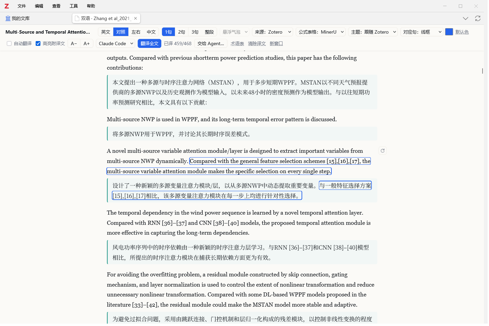

### 按需翻译，段落旁一键翻译

- 默认不自动翻译：点“翻译全文”或段落旁的按钮才开始；勾选“自动翻译”后翻译滚动到的部分。工具栏的设置都会记住。
- 鼠标移到某一段，右侧出现小按钮：未翻译时翻译这一段，已翻译时用当前引擎重新翻译，有失败句时变红、只重试失败的句子。
- 已翻译的句子缓存在本机，下次打开直接显示；选中句子可以“重新翻译”或“修改译文…”，手改的译文不会被覆盖。

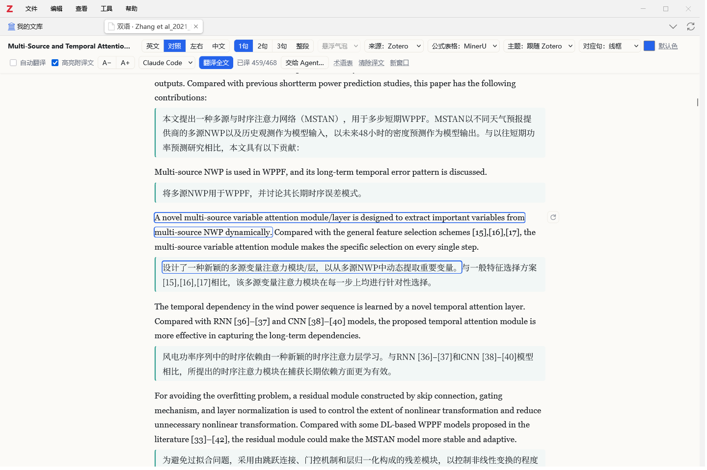

### 公式、表格和图片

图片从原 PDF 裁剪，点击放大看原图。有 [MinerU](#mineru可选) 解析时，公式用 LaTeX 排版（点击复制 LaTeX），表格可选中、可复制为 TSV；没有时用 PDF 截图，一样能读。

| 公式（LaTeX 排版） | 表格（可选中） |
| --- | --- |
| 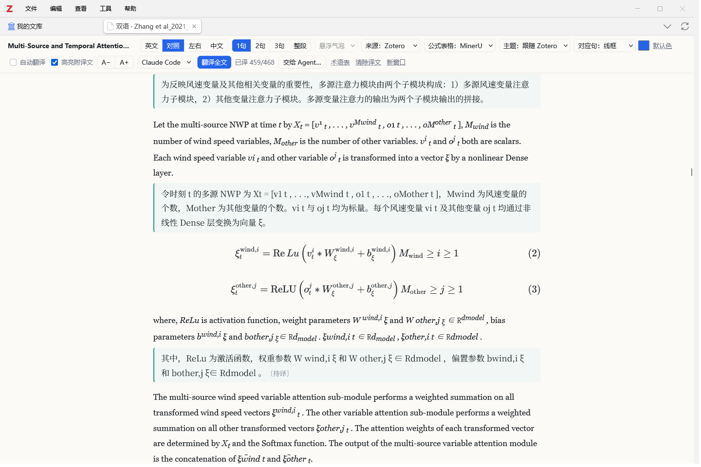 | 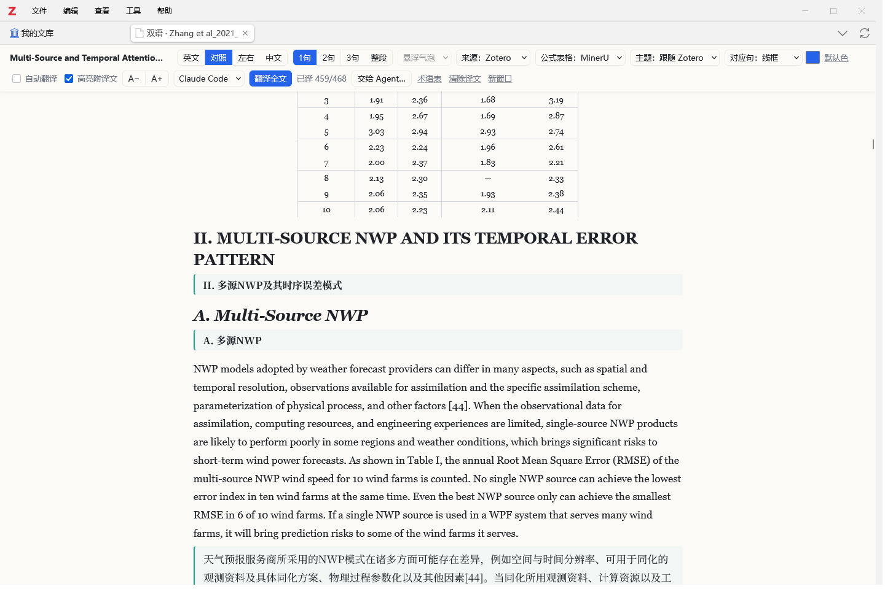 |

### 与原 PDF 联动

- 选中句子后点“在 PDF 中定位”，打开原 PDF 并跳到这句。
- 点色块在原 PDF 上创建高亮，默认把中文译文以“【译】…”写进批注；之后用 Zotero 的“从注释添加笔记”，笔记里中英文都有。
- 点击已高亮的句子，可以编辑批注、改颜色、在 PDF 中查看或删除。在 PDF 里做的高亮也会显示在双语页上。

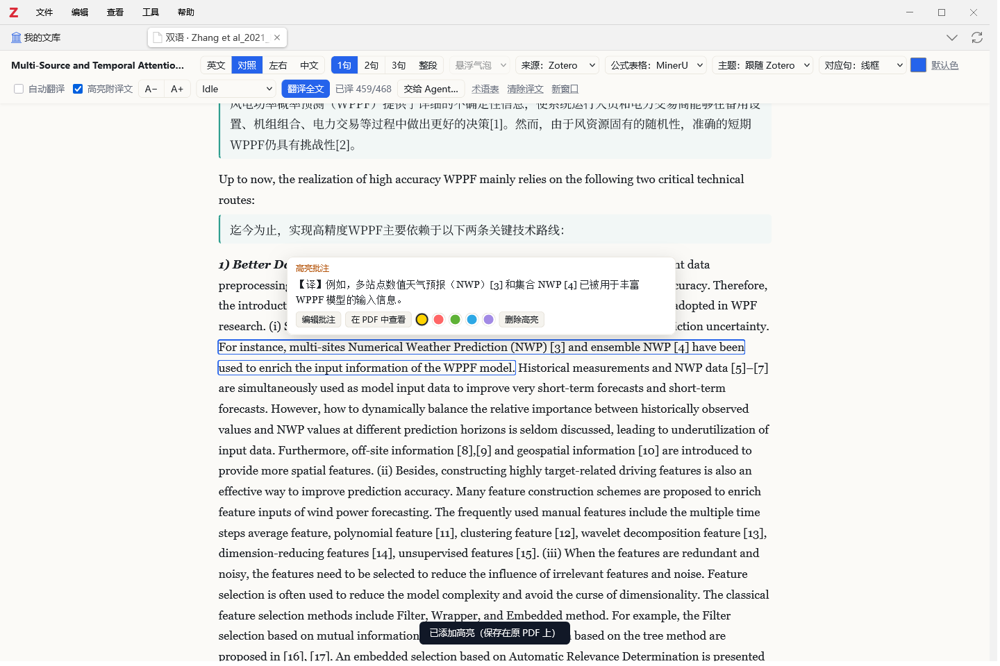

### 页内查找

`Ctrl+F` 同时搜英文原文和中文译文，`Enter` / `Shift+Enter` 上下跳转，`Esc` 关闭。

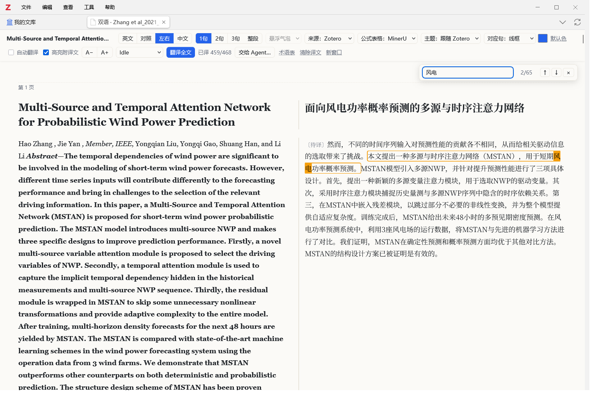

### 主题

跟随 Zotero、浅色、护眼（米黄）、深色。

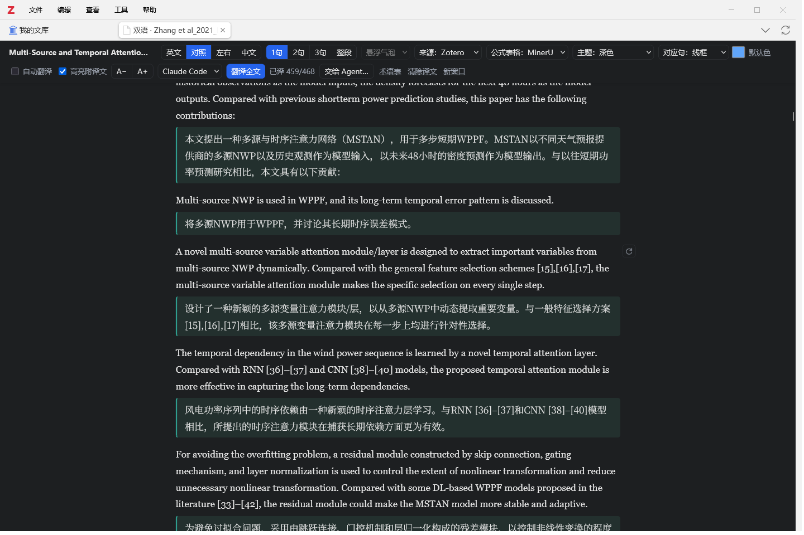

### 其他

- **两种正文来源**：Zotero 自带的结构化文本（能在 PDF 中定位和高亮），或 MinerU 解析结果（行内公式也排版）。
- **阅读位置**：重新打开时回到上次读到的位置。
- **失败句一键重试**：工具栏“失败 N 句，重试”只重发失败的句子。
- **文库预翻译**：文库里多选条目，右键“预翻译（双语阅读）”，后台逐篇翻译，不打开标签页。
- **新窗口**：把双语页移到独立窗口放在右半屏，配合 Win+← 就是左 PDF、右双语。
- **术语统一**：第一次翻译某篇论文时先定出关键术语，之后每一批都带上；也可以设置全局术语表。
- **交给 Agent 整篇翻译**：见下文。

## 安装

1. 从 [Releases](https://github.com/isCopyman/zotero-bilingual-reader/releases) 下载最新的 `bilingual-reader-*.xpi`。需要 Zotero 10。
2. 在 Zotero 中依次点“工具 → 插件”，再点右上角齿轮，选“从文件安装插件…”，选择这个 xpi。
3. 安装后在“设置 → 双语阅读”里配置翻译引擎：填一个 OpenAI 兼容 API（任何服务商都可以），或者用本机已登录的 Grok Build、Codex、Claude Code 命令行。

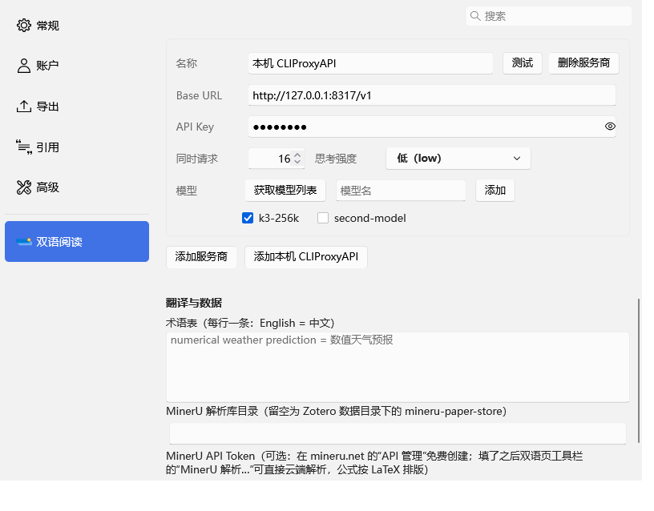

## 使用

- 在文库里右键条目或 PDF，选“双语阅读”；也可以在 PDF 阅读器的工具栏点双语按钮。双语页在新标签页打开，紧挨着这篇 PDF 的标签页。
- 第一次打开某篇 PDF 时，Zotero 需要先解析，进度会显示在页面上。

## MinerU（可选）

不装、不配 MinerU 也能完整使用：正文用 Zotero 自带的文本，图片、公式和表格从原 PDF 截图显示，翻译、高亮、定位都不受影响。

有 MinerU 解析时多两样：公式按 LaTeX 排版（点击复制 LaTeX）、表格变成可选中的表格；工具栏多出“来源：MinerU”，正文里的行内公式也排版。获得解析结果有两种方式：

1. **插件里一键云端解析（推荐普通用户）**
   1. 打开 [mineru.net](https://mineru.net)，注册登录，在“API 管理”里创建一个 API Token。免费额度为每天 1000 页（高优先级），单个文件不超过 200 页、200 MB。
   2. 在双语页工具栏点“MinerU 解析…”，粘贴 Token，点“保存并解析”。Token 也可以在“设置 → 双语阅读”里填写或修改。
   3. PDF 会上传到 MinerU 的服务器，排队和解析通常要几分钟，进度显示在工具栏。完成后公式表格自动换成 MinerU 版本，结果存在本机，以后打开直接使用。

   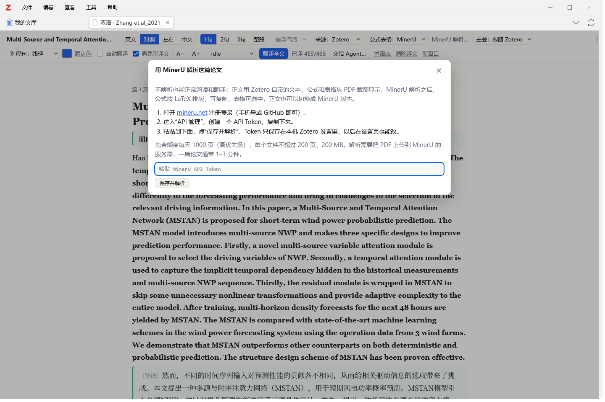

2. **自己用 MinerU 解析**（本地部署或其他脚本）：按 [docs/mineru.md](docs/mineru.md) 的目录格式放好结果，插件会自动识别。这份文档也写给 AI Agent 看，可以直接让 Agent 照着做。

## 翻译引擎

设置面板里点“检测引擎”，会显示本机能用的引擎。

| 引擎 | 说明 |
| --- | --- |
| Grok Build | 调用 `~/.grok/bin/grok`，单轮、禁用联网搜索。实测效果和速度都好，作为默认引擎。 |
| Codex CLI | 调用 Codex 桌面应用自带的 `codex.exe`（只读沙箱）。 |
| Claude Code | 调用 `claude -p`，需要先登录。 |
| OpenAI 兼容 API | 可添加多个服务商，每个填 Base URL 和 Key；“获取模型列表”后勾选模型，每个勾选的模型在阅读页引擎下拉里单独出现。 |

- 每个本机 Agent 一张卡片：状态、测试、模型和思考强度。模型和思考强度默认跟随该工具自己的设置，下拉框里列出它本机缓存的模型和该模型支持的强度。
- 可以设置同时请求数，修改后立即生效。Agent 的思考强度默认 medium：high 明显更慢（grok 一批约 4 分钟），翻译质量差别不大。
- **本机 CLIProxyAPI**：“添加本机 CLIProxyAPI”预设 `http://127.0.0.1:8317/v1`、模型 `k3-256k`、16 个同时请求、思考强度 low，Key 需自己填。实测 367 句 78 秒、0 失败，质量与 grok 相当，是分批翻译最快的选择。
- 翻译按段落分批送给模型，整段做上下文，每句单独返回。返回结果会被检查：引用编号、行内公式丢失、漏句或未翻译时自动重试。
- **本篇术语表**：第一次翻译某篇论文时，先用一次短请求从标题、各级标题和开头几段定出关键术语，之后每一批都带上，分批翻译的用词保持一致。工具栏“术语表”可以查看和修改。设置里的全局术语表（每行 `English = 中文`）优先。
- Agent 在插件自己的工作目录（`<Zotero 数据目录>/zotero-bilingual-reader/agent`）里运行，不读任何项目的规则文件；grok 关闭跨会话记忆，翻译结束后删除插件产生的 grok 会话记录。

### 交给 Agent 整篇翻译

工具栏“交给 Agent…”把本篇未翻译的句子和任务说明写进任务文件夹（`<Zotero 数据目录>/zotero-bilingual-reader/jobs/<库ID>-<附件key>/`），给出一段提示词和终端命令。把提示词发给你自己打开的 Agent 会话（grok、Codex、Claude Code、codeg 都可以），模型和思考强度在那边自己选。

- Agent 先写术语表，再分批写译文到 `parts/`，最后自查并写报告。插件每 3 秒读一次任务文件夹，译文写出就显示在页面上，工具栏显示进度和最后写入时间；超过 5 分钟没有新写入会提示去看看 Agent 是否停了。
- 报告写好后仍有缺漏或没通过检查的句子时，点“生成补译提示词”，发给同一个 Agent 会话补齐。
- 整篇翻译比分批慢（实测 10–15 分钟，其中自查和写报告占不少时间），适合想让 Agent 通读全文、统一文风的论文；日常阅读用分批翻译即可。

## 数据位置

- 译文缓存：`<Zotero 数据目录>/zotero-bilingual-reader/translations/<库ID>-<附件key>.json`，设置面板可以直接打开这个目录。阅读位置和本篇术语表也存在这里。译文按句子内容的哈希存放，Zotero 和 MinerU 两个来源里相同的句子共用译文。
- 整篇翻译任务：`<Zotero 数据目录>/zotero-bilingual-reader/jobs/`。
- MinerU 解析：`<Zotero 数据目录>/mineru-paper-store/attachments/<附件key>/`（目录可在设置里改）。`parse.json` 里的 `pdfSha256` 与当前 PDF 一致才使用；插件只在你点“MinerU 解析…”时往这里写入。格式见 [docs/mineru.md](docs/mineru.md)。
- 写进 Zotero 文库的只有你主动创建的高亮和批注，和在 Zotero 阅读器里做的高亮完全一样。

## 开发

```bash
npm install
npm run build          # 生成 .scaffold/build/bilingual-reader.xpi，并做类型检查
npm test               # 单元测试（vitest）；读真实论文的几组测试需要 test/fixtures/ 下的论文数据（未公开，缺少时自动跳过）
npm run test:zotero    # 在独立测试 profile 的 Zotero 里跑集成测试，截图在 test/out/
```

- 集成测试使用独立的测试 profile，不碰日常使用的 Zotero 文库。
- 测试只用假引擎，不发真实翻译请求；需要真实调用 grok 的测试默认跳过，设置环境变量 `ZBR_TEST_LIVE=1` 才会运行。

## 致谢

- 感谢 [LINUX DO](https://linux.do) 社区。
- [MinerU](https://github.com/opendatalab/MinerU)（公式与表格解析）、[KaTeX](https://katex.org)（公式排版）、[pdf.js](https://mozilla.github.io/pdf.js/)（图像裁剪）、[zotero-plugin-scaffold](https://github.com/northword/zotero-plugin-scaffold)。

## 许可

MIT
